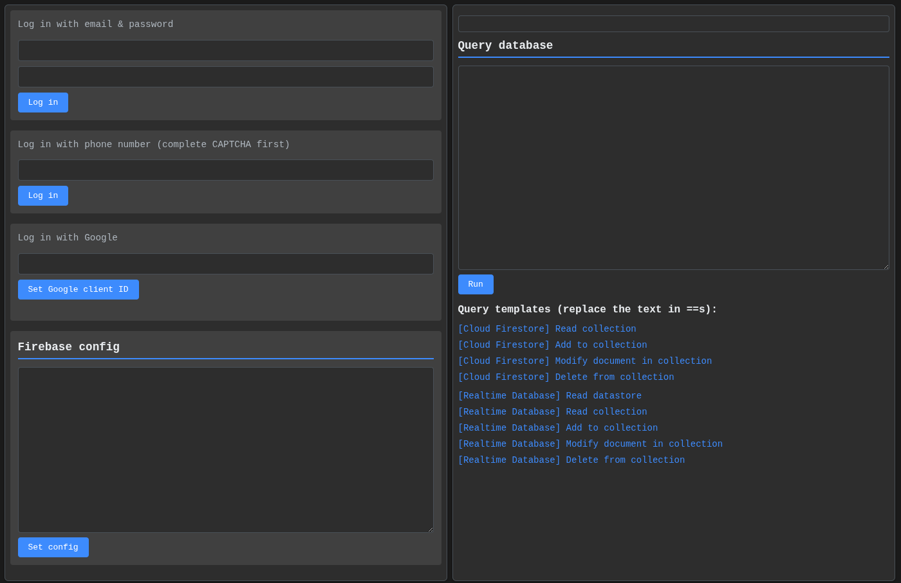

# Baserunner

A tool for exploring Firebase datastores.

## Set up

1. `git clone https://github.com/iosiro/baserunner.git`
2. `cd baserunner`
3. `npm run build`
4. `npm start`
5. Go to http://localhost:3000 in your browser.

## Usage

The Baserunner interface looks like this:



First, use the configuration textbox to load a Firebase configuration JSON structure from the app you'd like to test. It looks like this:

```javascript
var firebaseConfig = {
  apiKey: "API_KEY",
  authDomain: "PROJECT_ID.firebaseapp.com",
  databaseURL: "https://PROJECT_ID.firebaseio.com",
  projectId: "PROJECT_ID",
  storageBucket: "PROJECT_ID.appspot.com",
  messagingSenderId: "SENDER_ID",
  appId: "APP_ID",
  measurementId: "G-MEASUREMENT_ID",
};
```

Then log in as a regular user, either with email and password or with a mobile phone number. When logging in with a mobile phone number, complete the CAPTCHA before submitting your number. You then be prompted for an OTP from your SMS. Enter this without completing the CAPTCHA to finish logging in. Note that you can skip this step to test queries without authentication.

Finally, you can use the query interface to submit queries to the application's Cloud Firestore. Baserunner provides a number of template queries for common actions. Click on one of them to load it in the textbox, and replace the values that look `==LIKE THIS==` with valid names of collections, IDs, fields, etc.

As there is no way of getting a list of available collection using the Firebase JavaScript SDK, you will need to guess these, or source their names from the application's front-end JavaScript.

## Limitations

* Only supports Cloud Firestore, not Realtime Database.
* Does not support social login.


